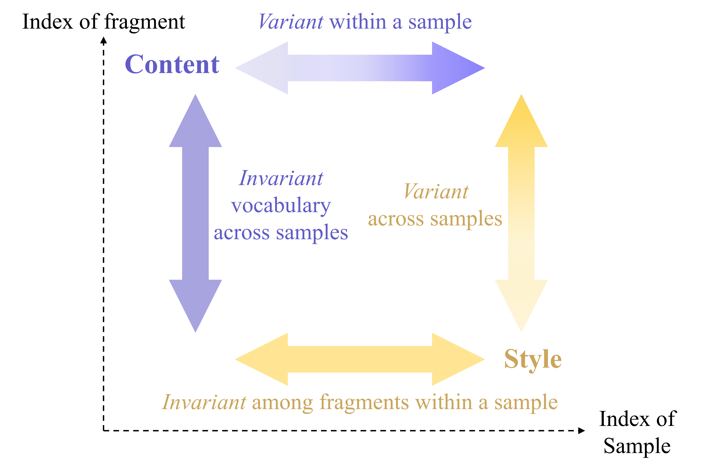

<!-- 
 -->

<!-- ***Abstract:*** 
    We contribute an unsupervised method that effectively learns from raw observation and disentangles its latent space into content and style representations. Unlike most disentanglement algorithms that rely on domain-specific labels and knowledge, our method is based on the insight of domain-general statistical differences between content and style --- **content varies more among different fragments within a sample but maintains an invariant vocabulary across data samples, whereas style remains relatively invariant within a sample but exhibits more significant variation across different samples**. We integrate such inductive bias into an encoder-decoder architecture and name our method after V3 (**v**ariance-**v**ersus-in**v**ariance). Experimental results show that V3 generalizes across two distinct domains in different modalities, music audio and images of written digits, successfully learning pitch-timbre and digit-color disentanglements, respectively. Also, the disentanglement robustness significantly outperforms baseline unsupervised methods and is even comparable to supervised counterparts. Furthermore, symbolic-level interpretability emerges in the learned codebook of content, forging a near one-to-one alignment between machine representation and human knowledge.
 -->

## Introduction

In this work, we contribute an unsupervised method that effectively learns from raw observation and disentangles its latent space into content and style representations. Unlike most disentanglement algorithms that rely on domain-specific labels and knowledge, our method is based on the meta-level insight of domain-general statistical differences between content and style --- **content varies more among different fragments within a sample but maintains an invariant vocabulary across data samples, whereas style remains relatively invariant within a sample but exhibits more significant variation across different samples**. We integrate such inductive bias into an encoder-decoder architecture and name our method after V3 (**v**ariance-**v**ersus-in**v**ariance).

This demonstration page serves as a supplement to Section 4.2 and 4.4 in the paper. Specifically, we provide provide interactive demos for experiments on the two synthetic datasets involved in the paper --- **PhoneNums** and **InsNotes**. PhoneNums contains images of written digit strings with different colors and other style variations, and InsNotes contains monophonic music audio played by single instruments with different pitches and expression variations.

<!-- The demos allow you to explore the learned codebook as the emergent vocabulary, the learned latent space, and the synthesized results performed by recombining latent content and style representations. -->

- **Visualizations of Latent Representations and Codebook Confusion Matrix**: As a supplement to Section 4.2 and Section 4.4, we provide a visual exploration of the learned latent representations of content and style, and confusion matrices between the learned codebook and ground truth content labels. Latent representations are visualized using t-SNE in 3D space. The colors of data points denote ground truth content or style labels. Visualizations with good groupings indicate better disentanglement performance. The codebook confusion matrix shows how well the learned vocabulary aligns with human knowledge. The horizontal axis represents the ground truth contents, and the vertical axis represents the learned codebook entries. The deeper the color, the higher the correlation.
  
- **Synthesized Results via Content-Style Recombination**: As a supplement to Section 4.4, we illustrate the interpretability of codebook and successfulness of content-style disentanglement by synthesizing new samples through recombining latent content and style factors. Under a specific codebook size, you can select an individual content or style source to see the corresponding recombination results. If a content index is selected, we will show the style transfer results of this content recombined with all styles (taking the mean of the style representations). If a style index is selected, we will show the style transfer results of this style recombined with all contents. Note that the content indices are sorted in the order of the codebook.

We compare V3 with the MINE-based method and the cycle loss-based method as mentioned in the paper. Note that all models shown in the demos have already got **good reconstruction performance**, which we omit here for simplicity.

 

## PhoneNums: Learning Digits and Colors

    <h3>Example data</h3>
    <image src="image_data_sample.svg" style="display: ">

In this demo, we show that V3 can learn to disentangle digits and colors from images of written digit strings. Above shows eight samples of different colors in the dataset. All 10 digits are involved, written in eight different colors. Note that although every line is written in a single color, there are rich variations in the position, noise, foreground and background color jitter, and the blurriness of digits.

We compare V3 with the MINE-based method and the cycle loss-based method as mentioned in the paper, by training all three methods on the image dataset without any supervision except segmentation. Below shows the **codebook confusion matrices**, **latent space visualizations** and **content-style recombinations** of all methods under different codebook size settings.

    <h3>Please choose codebook size:</h3> 
    <input type="radio" value="10" checked="checked" name="image_codebook"> <!--checked设置默认选中-->
    K=10
    <input type="radio" value="20" name="image_codebook">
    K=20
    <input type="radio" value="40" name="image_codebook">
    K=40
     
    <h3>Visualizations of symbol-level interpretability & latent representations</h3>
    <table style="text-align: center; margin:auto">
        <tr>
            <th>Method</td>
            <th style="width: 33%">Codebook Confusion Matrix</td>
            <th style="width: 33%">Content Latent Space</td>
            <th style="width: 33%">Style Latent Space</td>
        </tr>
        <tr>
            <td>V3 (Proposed)</td>
            <td>
                <image src="image_v3_10/codebook_confusion_matrix.svg" id="image_v3_10_cf" style="display: ">
                <image src="image_v3_20/codebook_confusion_matrix.svg" id="image_v3_20_cf" style="display: none"> 
                <image src="image_v3_40/codebook_confusion_matrix.svg" id="image_v3_40_cf" style="display: none"> 
            </td>
            <td>
                <image src="image_v3_10/emb_c_tsne_3d.svg" id="image_v3_10_c" style="display: ">
                <image src="image_v3_20/emb_c_tsne_3d.svg" id="image_v3_20_c" style="display: none"> 
                <image src="image_v3_40/emb_c_tsne_3d.svg" id="image_v3_40_c" style="display: none">
            </td>
            <td>
                <image src="image_v3_10/emb_s_tsne_3d.svg" id="image_v3_10_s" style="display: ">
                <image src="image_v3_20/emb_s_tsne_3d.svg" id="image_v3_20_s" style="display: none"> 
                <image src="image_v3_40/emb_s_tsne_3d.svg" id="image_v3_40_s" style="display: none"> 
            </td>
        </tr>
        <tr>
            <td>MINE-based</td>
            <td>
                <image src="image_mine_10/codebook_confusion_matrix.svg" id="image_mine_10_cf" style="display: ">
                <image src="image_mine_20/codebook_confusion_matrix.svg" id="image_mine_20_cf" style="display: none"> 
                <image src="image_mine_40/codebook_confusion_matrix.svg" id="image_mine_40_cf" style="display: none"> 
            </td>
            <td>
                <image src="image_mine_10/emb_c_tsne_3d.svg" id="image_mine_10_c" style="display: ">
                <image src="image_mine_20/emb_c_tsne_3d.svg" id="image_mine_20_c" style="display: none"> 
                <image src="image_mine_40/emb_c_tsne_3d.svg" id="image_mine_40_c" style="display: none">
            </td>
            <td>
                <image src="image_mine_10/emb_s_tsne_3d.svg" id="image_mine_10_s" style="display: ">
                <image src="image_mine_20/emb_s_tsne_3d.svg" id="image_mine_20_s" style="display: none"> 
                <image src="image_mine_40/emb_s_tsne_3d.svg" id="image_mine_40_s" style="display: none"> 
            </td>
        </tr>
        <tr>
            <td>Cycle loss</td>
            <td>
                <image src="image_cycle_10/codebook_confusion_matrix.svg" id="image_cycle_10_cf" style="display: ">
                <image src="image_cycle_20/codebook_confusion_matrix.svg" id="image_cycle_20_cf" style="display: none"> 
                <image src="image_cycle_40/codebook_confusion_matrix.svg" id="image_cycle_40_cf" style="display: none"> 
            </td>
            <td>
                <image src="image_cycle_10/emb_c_tsne_3d.svg" id="image_cycle_10_c" style="display: ">
                <image src="image_cycle_20/emb_c_tsne_3d.svg" id="image_cycle_20_c" style="display: none"> 
                <image src="image_cycle_40/emb_c_tsne_3d.svg" id="image_cycle_40_c" style="display: none">
            </td>
            <td>
                <image src="image_cycle_10/emb_s_tsne_3d.svg" id="image_cycle_10_s" style="display: ">
                <image src="image_cycle_20/emb_s_tsne_3d.svg" id="image_cycle_20_s" style="display: none"> 
                <image src="image_cycle_40/emb_s_tsne_3d.svg" id="image_cycle_40_s" style="display: none"> 
            </td>
        </tr>
        <tr>
            <td>Legends</td>
            <td>
                <image src="confusion_mtx_legend.svg" id="cf_legend" style="width: 25%; margin: auto">
            </td>
            <td>
                <image src="image_legend_c.svg" id="image_c_legend" style="width: 42%; margin: auto">
            </td>
            <td>
                <image src="image_legend_s.svg" id="image_s_legend" style="width: 100%; margin: auto">
            </td>
        </tr>
    </table>
     
    <h3>Please choose a content or style for traversal:</h3>
    <table>
        <tr>
            <td>
                Fix content index, traverse all styles:
            </td>
            <td>
            Or
            </td>
            <td>
                Fix style, traverse all content indices:
            </td>
        </tr>
        <tr>
            <td>
                

            </td>
            <td>
            </td>
            <td>
                

            </td>
        </tr>
    </table>
    <!-- Fix content index, traverse all styles:
    

    Fix style, traverse all content indices:
    

 -->
    <h3>Synthesized results via content-style recombination</h3>
    <table>
        <tr>
            <td>
                V3 (Proposed)
            </td>
            <td>
                

            </td>
        </tr>
        <tr>
            <td>
                MINE-based
            </td>
            <td>
                

            </td>
        </tr>
        <tr>
            <td>
                Cycle loss
            </td>
            <td>
                

            </td>
        </tr>
    </table>
    <!-- 

 -->
    From both the visualizations and the recombination synthesis results, we can see that V3 successfully learns to disentangle the digits and colors well. The content and style representations show clear locality compared to ground truth labels. The confusion matrices show a near one-to-one alignment with human knowledge when there is no codebook redundancy (K=10), and a full coverage and interpretability when there is codebook redundancy (K=20 and K=40). The style transfer results are also correct and semantically meaningful compared to the baselines.

   

## InsNotes: Learning Pitches and Timbres

    <h3>Example data</h3>
    <table style="text-align: center; margin:auto">
        <tr>
            <td>
                <image src="music_data_sample_1.png" style="width: 100%; margin:auto">
            </td>
            <td>
                <image src="music_data_sample_2.png" style="width: 100%; margin:auto">
            </td>
            <td>
                <image src="music_data_sample_3.png" style="width: 100%; margin:auto">
            </td>
        </tr>
        <tr>
            <td>
                <audio id="player1" controls controlsList="nodownload" preload="none">
                    <source src="music_data_sample_1.wav">
                </audio>
            </td>
            <td>
                <audio id="player2" controls controlsList="nodownload" preload="none">
                    <source src="music_data_sample_2.wav">
                </audio>
            </td>
            <td>
                <audio id="player3" controls controlsList="nodownload" preload="none">
                    <source src="music_data_sample_3.wav">
                </audio>
            </td>
        </tr>
    </table>

In this demo, we show that V3 can learn to disentangle pitch and timbre from raw music audio played by single instruments. Above shows the spectrograms and the audio files of some samples in the dataset. There are 12 pitches (a full octave) and 12 timbres involved in the dataset. Note that although each sample is played by only one instrument, there are rich velocity and amplitude envelope variations.

We compare V3 with the MINE-based method and the cycle loss-based method as mentioned in the paper, by training all three methods on the music dataset without any supervision except segmentation. Below shows the **codebook confusion matrices**, **latent space visualizations** and **content-style recombinations** of all methods under different codebook size settings.

    <h3>Please choose codebook size:</h3> 
    <input type="radio" value="12" checked="checked" name="music_codebook"> <!--checked设置默认选中-->
    K=12
    <input type="radio" value="24" name="music_codebook">
    K=24
    <input type="radio" value="48" name="music_codebook">
    K=48
     
    <h3>Visualizations of symbol-level interpretability & latent representations</h3>
    <table style="text-align: center; margin:auto">
        <tr>
            <th>Method</td>
            <th style="width: 33%">Codebook Confusion Matrix</td>
            <th style="width: 33%">Content Latent Space</td>
            <th style="width: 33%">Style Latent Space</td>
        </tr>
        <tr>
            <td>V3 (Proposed)</td>
            <td>
                <image src="music_v3_12/codebook_confusion_matrix.svg" id="music_v3_12_cf" style="display: ">
                <image src="music_v3_24/codebook_confusion_matrix.svg" id="music_v3_24_cf" style="display: none"> 
                <image src="music_v3_48/codebook_confusion_matrix.svg" id="music_v3_48_cf" style="display: none"> 
            </td>
            <td>
                <image src="music_v3_12/emb_c_tsne_3d.svg" id="music_v3_12_c" style="display: ">
                <image src="music_v3_24/emb_c_tsne_3d.svg" id="music_v3_24_c" style="display: none"> 
                <image src="music_v3_48/emb_c_tsne_3d.svg" id="music_v3_48_c" style="display: none">
            </td>
            <td>
                <image src="music_v3_12/emb_s_tsne_3d.svg" id="music_v3_12_s" style="display: ">
                <image src="music_v3_24/emb_s_tsne_3d.svg" id="music_v3_24_s" style="display: none"> 
                <image src="music_v3_48/emb_s_tsne_3d.svg" id="music_v3_48_s" style="display: none"> 
            </td>
        </tr>
        <tr>
            <td>MINE-based</td>
            <td>
                <image src="music_mine_12/codebook_confusion_matrix.svg" id="music_mine_12_cf" style="display: ">
                <image src="music_mine_24/codebook_confusion_matrix.svg" id="music_mine_24_cf" style="display: none"> 
                <image src="music_mine_48/codebook_confusion_matrix.svg" id="music_mine_48_cf" style="display: none"> 
            </td>
            <td>
                <image src="music_mine_12/emb_c_tsne_3d.svg" id="music_mine_12_c" style="display: ">
                <image src="music_mine_24/emb_c_tsne_3d.svg" id="music_mine_24_c" style="display: none"> 
                <image src="music_mine_48/emb_c_tsne_3d.svg" id="music_mine_48_c" style="display: none">
            </td>
            <td>
                <image src="music_mine_12/emb_s_tsne_3d.svg" id="music_mine_12_s" style="display: ">
                <image src="music_mine_24/emb_s_tsne_3d.svg" id="music_mine_24_s" style="display: none"> 
                <image src="music_mine_48/emb_s_tsne_3d.svg" id="music_mine_48_s" style="display: none"> 
            </td>
        </tr>
        <tr>
            <td>Cycle loss</td>
            <td>
                <image src="music_cycle_12/codebook_confusion_matrix.svg" id="music_cycle_12_cf" style="display: ">
                <image src="music_cycle_24/codebook_confusion_matrix.svg" id="music_cycle_24_cf" style="display: none"> 
                <image src="music_cycle_48/codebook_confusion_matrix.svg" id="music_cycle_48_cf" style="display: none"> 
            </td>
            <td>
                <image src="music_cycle_12/emb_c_tsne_3d.svg" id="music_cycle_12_c" style="display: ">
                <image src="music_cycle_24/emb_c_tsne_3d.svg" id="music_cycle_24_c" style="display: none"> 
                <image src="music_cycle_48/emb_c_tsne_3d.svg" id="music_cycle_48_c" style="display: none">
            </td>
            <td>
                <image src="music_cycle_12/emb_s_tsne_3d.svg" id="music_cycle_12_s" style="display: ">
                <image src="music_cycle_24/emb_s_tsne_3d.svg" id="music_cycle_24_s" style="display: none"> 
                <image src="music_cycle_48/emb_s_tsne_3d.svg" id="music_cycle_48_s" style="display: none"> 
            </td>
        </tr>
        <tr>
            <td>Legends</td>
            <td>
                <image src="confusion_mtx_legend.svg" id="cf_legend" style="width: 25%; margin: auto">
            </td>
            <td>
                <image src="music_legend_c.svg" id="music_c_legend" style="width: 42%; margin: auto">
            </td>
            <td>
                <image src="music_legend_s.svg" id="music_s_legend" style="width: 100%; margin: auto">
            </td>
        </tr>
    </table>
     
    <h3>Please choose content or style for traversal:</h3>
    <table>
        <tr>
            <td>
                Fix content index, traverse all styles:
            </td>
            <td>
            Or
            </td>
            <td>
                Fix style, traverse all content indices:
            </td>
        </tr>
        <tr>
            <td>
                

            </td>
            <td>
            </td>
            <td>
                

            </td>
        </tr>
    </table>
    <!-- Fix content index, traverse all styles:
    

    Fix style, traverse all content indices:
    

 -->
    <h3>Synthesized results via content-style recombination</h3>
    <table>
        <tr>
            <td>
                V3 (Proposed)
            </td>
            <td>
                

            </td>
        </tr>
        <tr>
            <td>
                MINE-based
            </td>
            <td>
                

            </td>
        </tr>
        <tr>
            <td>
                Cycle loss
            </td>
            <td>
                

            </td>
        </tr>
    </table>
    <!-- 

 -->
    From both the visualizations and the recombination synthesis results, we can see that V3 successfully learns to disentangle the pitches and timbres well. The content and style representations show clear locality compared to ground truth labels. The confusion matrices show a clear one-to-one alignment with human knowledge when there is no codebook redundancy (K=12), and most codebook entries are still interpretable when there is codebook redundancy (K=24 and K=48). The style transfer results are also correct and semantically meaningful when K=12 compared to the baselines. Even though there are imperfections when K=24 and K=48, the results are still better than the baselines as all pitches are covered when traversing all content indices with a fixed style, and all notes are produced as supposed when traversing all timbres with a meaningful fixed content index well-aligned with human knowledge. 

